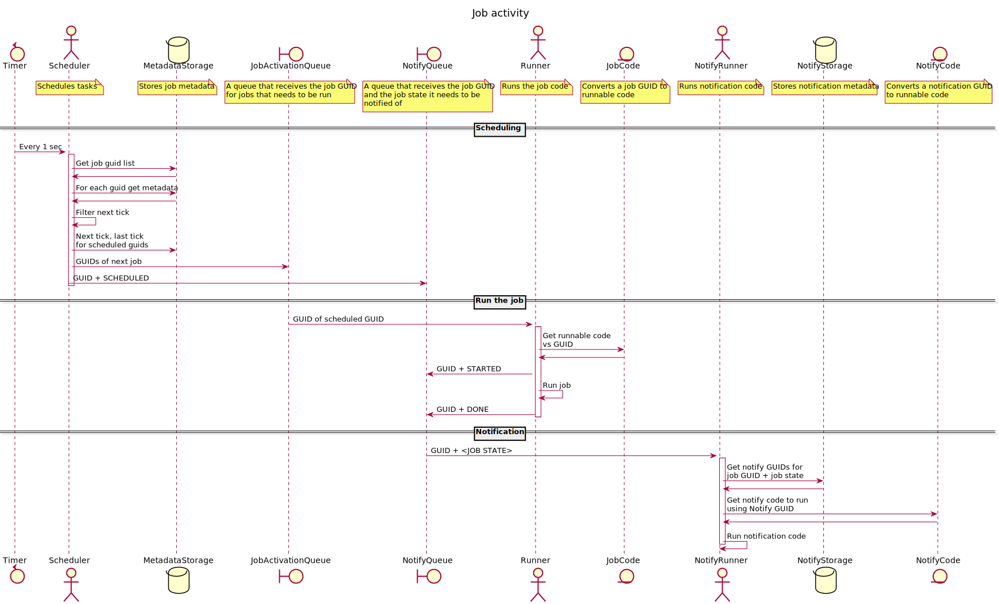
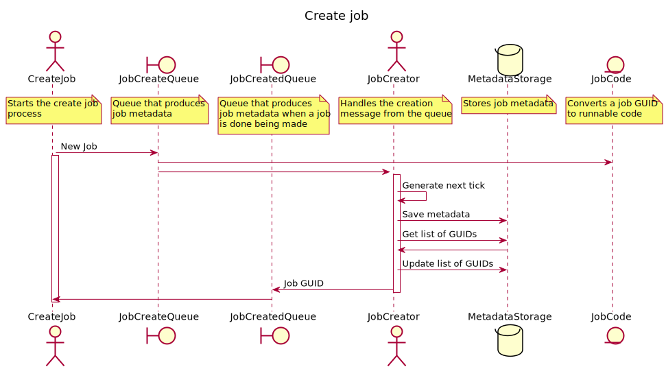
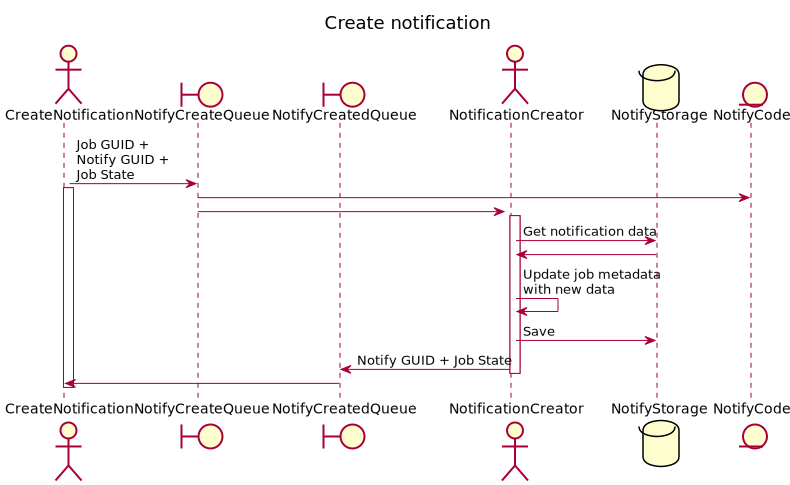
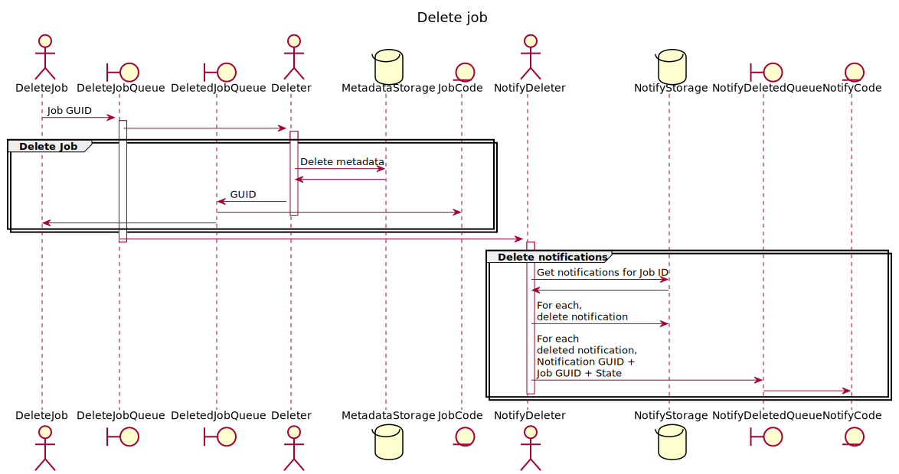
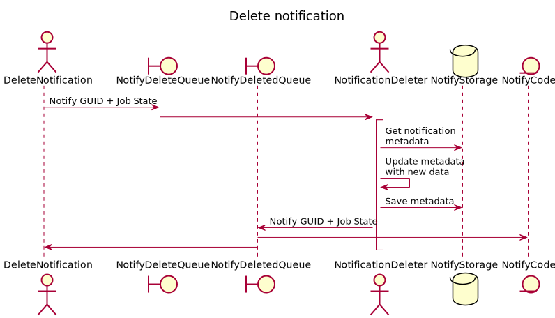

# tokio-cron-scheduler

Use cron-like scheduling in an async tokio environment.
Also, schedule tasks instantly or repeat them at a fixed duration.
Task data can optionally be persisted using PostgreSQL or Nats.

Inspired by https://github.com/lholden/job_scheduler

[](https://docs.rs/tokio_cron_scheduler) [](https://crates.io/crates/tokio_cron_scheduler) [](https://travis-ci.org/mvniekerk/tokio_cron_scheduler)

## Usage

Please see the [Documentation](https://docs.rs/tokio_cron_scheduler/) for more details.

Be sure to add the job_scheduler crate to your `Cargo.toml`:

```toml
[dependencies]
tokio-cron-scheduler = "*"
```

Creating a schedule for a job is done using the `FromStr` impl for the
`Schedule` type of the [cron](https://github.com/zslayton/cron) library.

The scheduling format is as follows:

```text
sec   min   hour   day of month   month   day of week   year
*     *     *      *              *       *             *
```

Time is specified for `UTC` and not your local timezone. Note that the year may
be omitted. If you want for your timezone, append `_tz` to the job creation calls (for instance
Job::new_async vs Job::new_async_tz).

Comma-separated values such as `5,8,10` represent more than one time value. So
for example, a schedule of `0 2,14,26 * * * *` would execute on the 2nd, 14th,
and 26th minute of every hour.

Ranges can be specified with a dash. A schedule of `0 0 * 5-10 * *` would
execute once per hour but only on days 5 through 10 of the month.

The day of the week can be specified as an abbreviation or the full name. A
schedule of `0 0 6 * * Sun,Sat` would execute at 6 am on Sunday and Saturday.

Per job, you can be notified when the jobs were started, stopped and removed. Because these notifications
are scheduled using tokio::spawn, the order of these are not guaranteed if the task finishes quickly.

A simple usage example:

```rust
use std::time::Duration;
use tokio_cron_scheduler::{Job, JobScheduler, JobSchedulerError};

#[tokio::main]
async fn main() -> Result<(), JobSchedulerError> {
    let mut sched = JobScheduler::new().await?;

    // Add basic cron job
    sched.add(
        Job::new("1/10 * * * * *", |_uuid, _l| {
            println!("I run every 10 seconds");
        })?
    ).await?;

    // Add async job
    sched.add(
        Job::new_async("1/7 * * * * *", |uuid, mut l| {
            Box::pin(async move {
                println!("I run async every 7 seconds");

                // Query the next execution time for this job
                let next_tick = l.next_tick_for_job(uuid).await;
                match next_tick {
                    Ok(Some(ts)) => println!("Next time for 7s job is {:?}", ts),
                    _ => println!("Could not get next tick for 7s job"),
                }
            })
        })?
    ).await?;

    // Add one-shot job with given duration
    sched.add(
        Job::new_one_shot(Duration::from_secs(18), |_uuid, _l| {
            println!("I only run once");
        })?
    ).await?;

    // Create repeated job with given duration, make it mutable to edit it afterwards
    let mut jj = Job::new_repeated(Duration::from_secs(8), |_uuid, _l| {
        println!("I run repeatedly every 8 seconds");
    })?;

    // Add actions to be executed when the jobs starts/stop etc.
    jj.on_start_notification_add(&sched, Box::new(|job_id, notification_id, type_of_notification| {
        Box::pin(async move {
            println!("Job {:?} was started, notification {:?} ran ({:?})", job_id, notification_id, type_of_notification);
        })
    })).await?;

    jj.on_stop_notification_add(&sched, Box::new(|job_id, notification_id, type_of_notification| {
        Box::pin(async move {
            println!("Job {:?} was completed, notification {:?} ran ({:?})", job_id, notification_id, type_of_notification);
        })
    })).await?;

    jj.on_removed_notification_add(&sched, Box::new(|job_id, notification_id, type_of_notification| {
        Box::pin(async move {
            println!("Job {:?} was removed, notification {:?} ran ({:?})", job_id, notification_id, type_of_notification);
        })
    })).await?;
    sched.add(jj).await?;

    // Feature 'signal' must be enabled
    sched.shutdown_on_ctrl_c();

    // Add code to be run during/after shutdown
    sched.set_shutdown_handler(Box::new(|| {
        Box::pin(async move {
            println!("Shut down done");
        })
    }));

    // Start the scheduler
    sched.start().await?;

    // Wait while the jobs run
    tokio::time::sleep(Duration::from_secs(100)).await;

    Ok(())
}

```

### Timezone changes

You can create a job using a specific timezone using the `JobBuilder` API.
chrono-tz is not included into the dependencies, so you need to add it to your Cargo.toml if you
would like to have easy creation of a `Timezone` struct.

```rust 
    let job = JobBuilder::new()
.with_timezone(chrono_tz::Africa::Johannesburg)
.with_cron_job_type()
.with_schedule("*/2 * * * * *")
.unwrap()
.with_run_async(Box::new( | uuid, mut l| {
Box::pin(async move {
info ! ("JHB run async every 2 seconds id {:?}", uuid);
let next_tick = l.next_tick_for_job(uuid).await;
match next_tick {
Ok(Some(ts)) => info !("Next time for JHB 2s is {:?}", ts),
_ => warn !("Could not get next tick for 2s job"),
}
})
}))
.build()
.unwrap();
```

## Similar Libraries

* [job_scheduler](https://github.com/lholden/job_scheduler) The crate that inspired this one
* [cron](https://github.com/zslayton/cron) the cron expression parser we use.
* [schedule-rs](https://github.com/mehcode/schedule-rs) is a similar rust library that implements its own cron
  expression parser.

## License

TokioCronScheduler is licensed under either of

* Apache License, Version 2.0, ([LICENSE-APACHE](LICENSE-APACHE) or
  http://www.apache.org/licenses/LICENSE-2.0)
* MIT license ([LICENSE-MIT](LICENSE-MIT) or
  http://opensource.org/licenses/MIT)

## Custom storage

The MetadataStore and NotificationStore traits can be implemented and be used in the JobScheduler.

A default volatile hashmap-based version is provided by the SimpleMetadataStore and SimpleNotificationStore. A
persistent version using Nats is provided with NatsMetadataStore and NatsNotificationStore.

## Contributing

Unless you explicitly state otherwise, any contribution intentionally submitted
for inclusion in the work by you, as defined in the Apache-2.0 license, shall
be dual licensed as above, without any additional terms or conditions.

Please see the [CONTRIBUTING](CONTRIBUTING.md) file for more information.

## Features

### has_bytes

Since 0.7

Enables Prost-generated data structures to be used by stores that need to get the bytes
of the data structs. The Nats and Postgres stores depend on this feature being enabled.

### postgres_storage

Since 0.6

Adds the Postgres metadata store and notification store (PostgresMetadataStore, PostgresNotificationStore). Use a Postgres
database to store the metadata and notification data.

See [PostgreSQL docs](./postgres.md)

### postgres_native_tls

Since 0.6

Uses postgres-native-tls crate as the TLS provider for the PostgreSQL connection.

### postgres_openssl

Since 0.6

Uses the postgres-openssl crate as the TLS provider for the PostgreSQL connection.

### nats_storage

Since 0.6

Adds the Nats metadata store and notification store (NatsMetadataStore, NatsNotificationStore). Use a Nats system as a way
to store the metadata and notifications.

See [Nats docs](./nats.md)

### signal

Since 0.5

Adds `shutdown_on_signal` and `shutdown_on_ctrl_c` to the scheduler.
Both shut the system down (stop the scheduler and remove all the tasks) when a signal
is received.

As this leverages the signal handling from Tokio, this is only available on Unix systems.

## Writing tests

When doing a tokio::test, remember to have it run in a multi-threaded context otherwise, the test
will hang on `scheduler.add()`.

For example:

```rust

#[cfg(test)]
mod test {
    use tokio_cron_scheduler::{Job, JobScheduler};
    use tracing::{info, Level};
    use tracing_subscriber::FmtSubscriber;

    // Needs multi_thread to test, otherwise it hangs on scheduler.add()
    #[tokio::test(flavor = "multi_thread", worker_threads = 2)]
    // #[tokio::test]
    async fn test_schedule() {
        let subscriber = FmtSubscriber::builder()
            .with_max_level(Level::TRACE)
            .finish();
        tracing::subscriber::set_global_default(subscriber)
            .expect("Setting default subscriber failed");

        info!("Create scheduler");
        let scheduler = JobScheduler::new().await.unwrap();
        info!("Add job");
        scheduler
            .add(
                Job::new_async("*/1  * * * * *", |_, _| {
                    Box::pin(async {
                        info!("Run every seconds");
                    })
                })
                    .unwrap(),
            )
            .await
            .expect("Should be able to add a job");

        scheduler.start().await.unwrap();

        tokio::time::sleep(core::time::Duration::from_secs(20)).await;
    }
}
```

## Examples

### simple

Runs the in-memory hashmap-based storage

```shell
 cargo run --example simple --features="tracing-subscriber"
```

### postgres

Needs a running PostgreSQL instance first:

```shell
docker run --rm -it -p 5432:5432 -e POSTGRES_USER="postgres" -e POSTGRES_PASSWORD="" -e POSTGRES_HOST_AUTH_METHOD="trust" postgres:14.1
```

Then run the example:

```shell
POSTGRES_INIT_METADATA=true POSTGRES_INIT_NOTIFICATIONS=true cargo run --example postgres --features="postgres_storage tracing-subscriber"
```

### nats

Needs a running Nats instance first with Jetstream enabled:

```shell
docker run --rm -it -p 4222:4222 -p 6222:6222 -p 7222:7222 -p 8222:8222 nats -js -DV
```

Then run the example:

```shell
cargo run --example nats --features="nats_storage tracing-subscriber"
```

## Design

### Job activity



### Create job



### Create notification



### Delete job



### Delete notification


